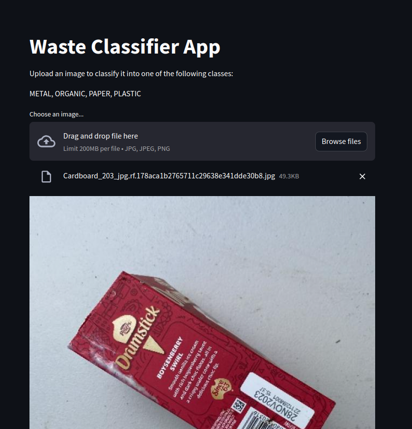
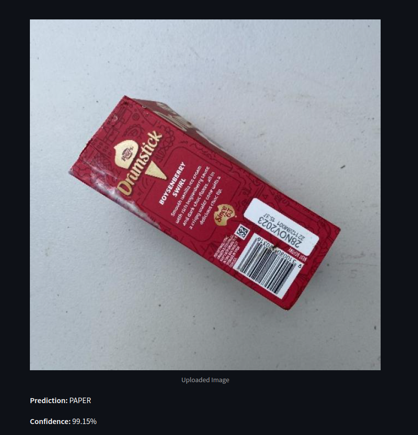

# Waste Classifier Web App using MobileNetV2

This project is a deep learning-based **image classification web application** that classifies uploaded waste images into one of four categories: **METAL, ORGANIC, PAPER, and PLASTIC**.

The app utilizes a **pretrained MobileNetV2 model** fine-tuned on a custom waste classification dataset and is served via a **Streamlit** web interface.

---

## Table of Contents

1. [Overview](#overview)
2. [Project Features](#project-features)
3. [Setup Instructions](#setup-instructions)
4. [Run the Application](#run-the-application)
5. [Model Details](#model-details)
6. [App Usage](#app-usage)
7. [Sample Output](#sample-output)

---

## Overview

The Waste Classifier Web App enables users to upload an image of waste, and the model will predict its category. This solution aims to:

- Automate waste sorting for environmental sustainability.
- Leverage deep learning transfer learning techniques using **MobileNetV2**.
- Provide an easy-to-use interface using **Streamlit**.

---

## Project Features

- **Image Classification**: Predicts waste categories (METAL, ORGANIC, PAPER, PLASTIC).
- **Pretrained Model**: MobileNetV2 pretrained on ImageNet, fine-tuned on a waste dataset.
- **Interactive Web App**: Built using Streamlit for easy image uploads and predictions.

---

## Setup Instructions

### **1. Clone the Repository**

Clone the project repository to your local machine:

```bash
git clone https://github.com/RohmaButt/garbage-sorting-image-classification.git
cd waste-classifier-streamlit
```

### 2. Create and Activate a Virtual Environment

Create an isolated Python environment using venv:

```bash
python3 -m venv venv
source venv/bin/activate  # For Linux/Mac
venv\Scripts\activate     # For Windows
```

### 3. Install Dependencies

Install all required Python libraries using pip:

```bash
pip install -r requirements.txt
```

### 4. Save the Model

Ensure the trained MobileNetV2 model (mobilenetv2_waste_classifier.h5) is present in the project directory.

If not, place the model file in the project root.

Run the Application
To run the Streamlit app, execute the following command in your terminal:

```bash
streamlit run app.py
```

Once the app is running, it will provide the Local URL and Network URL:

```bash
Local URL: http://localhost:8501
Network URL: http://<your-ip-address>:8501
```

Open the Local URL in your browser to interact with the app.

## Sample Output

Below are some demo screenshots of the **Waste Classifier Web App** in action:

---

### **1. Uploaded Image and Prediction**

**Screenshot 1**: Uploading an image and getting the predicted waste category.



---

### **2. Prediction Result**

**Screenshot 2**: The model predicts the class along with the confidence score.



---
